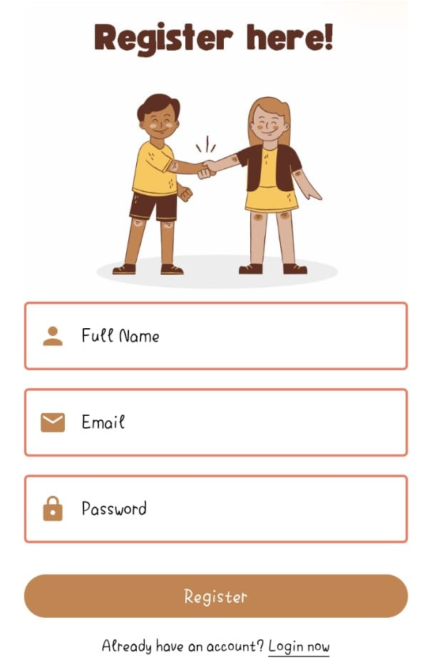
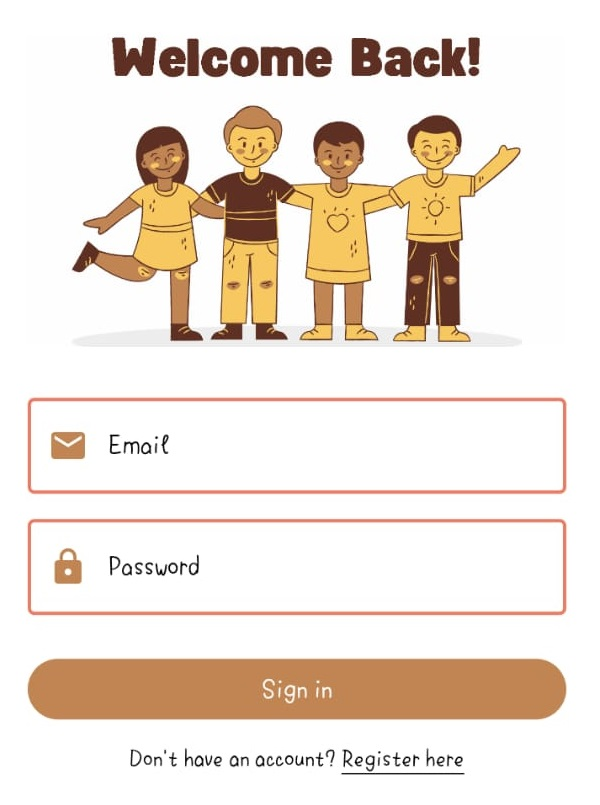
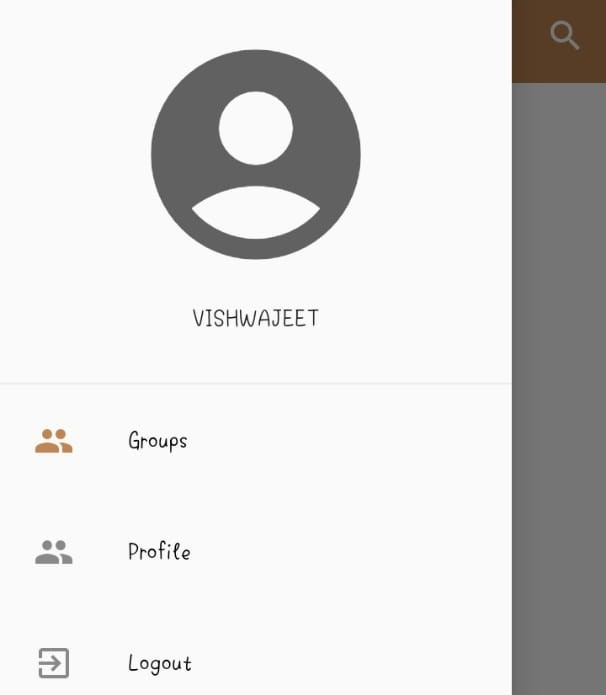

# Pesonal_Chatting_App_Using_Flutter_And_Firebase
Community Group based chat app in Flutter and Firebase with Cloudfirestore, Firebase Auth and StreamBuilders

# Key Features
1. Login
2. Sign Up / Register
3. Create a Group
4. Join in a Group with your friends
5. Chat with joinies in a group
6. Delete a Group
7. Check own Profile Details
8. Know Group Details 

## [Watch it on YouTube](https://youtube.com/@TechyVishwajeet)
 
 ## SETTING IT UP
 1. Add firbease to this project and do check the google-services.json and GoogleServices-Info.plist file
 2. Now run the app
 
## App UI

### Register
  
### Login
  
### Profile
  
### Drawer Menu
  
### Create a Group
  
### Groups Joined
  
### Chats
  
### Search
  
 
Subscribe Now! <a href="https://youtube.com/@TechyVishwajeet">YouTube Channel</a>
Show some :heart: and star the repo to support the project

<h3></h3>
 

## Note
 I do not own any of the images used in this project.